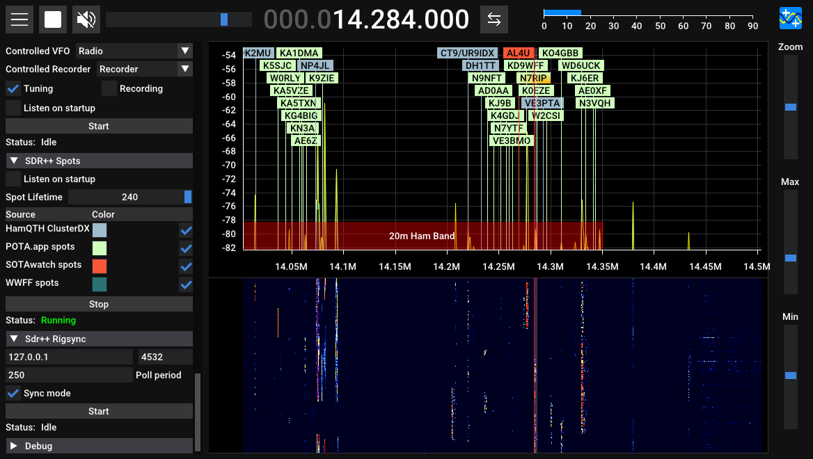

# SDR++ Spots Module



Adds spots to the waterfall display in [SDR++](https://github.com/AlexandreRouma/SDRPlusPlus).

Sources of spots:
 * ClusterDX network from [HamQTH](https://hamqth.com) API
 * [POTA.app](https://pota.app) spots
 * [SOTAWatch](https://sotawatch.sota.org.uk/en/) spots
 * [World Wide Flora and Fauna in amateur radio](https://wwff.co/) spots

# Building

1. Download the SDR++ source code: `git clone https://github.com/AlexandreRouma/SDRPlusPlus`
2. Open the top-level `CMakeLists.txt` file, and add the following line in the
   `# Misc` section at the top:
```
option(OPT_BUILD_SPOTS "Build spots plugin" ON)
```
3. In that same file, search for the second `# Misc` section, and add the
   following lines:
```
if (OPT_BUILD_SPOTS)
add_subdirectory("misc_modules/sdrpp-spots")
endif (OPT_BUILD_SPOTS)
```
4. Navigate to the `misc_modules` folder, then clone this repository: `git clone https://github.com/gerner/sdrpp-spots --recurse-submodules`
5. Build and install SDR++ following the guide in the original repository
6. Enable the module by adding it via the module manager

Thanks to [dbdexter-dev/sdrpp_radiosonde](https://github.com/dbdexter-dev/sdrpp_radiosonde/tree/master) from which I based these directions.
